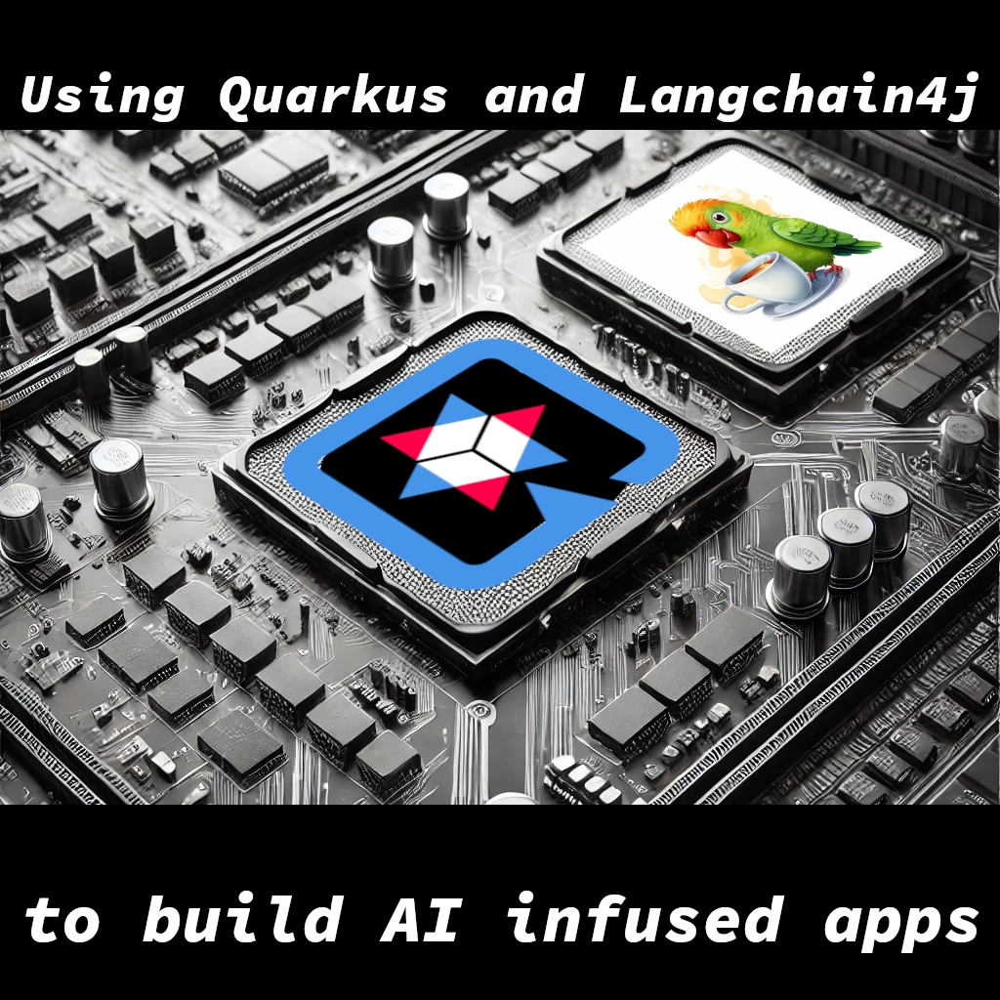

<!-- .element height="50%" width="50%" -->

---

#### About me


---

#### My presentations
<!-- .element height="50%" width="50%" -->

---

### Hackathon Theme
<!-- .element height="50%" width="50%" -->

---

### Selecting tools

  - **AI**
  - **Sustainability**
  - **Rapid prototyping**

---

### Selecting a programming language

<!-- .element height="50%" width="50%" -->

---

### About Python ?

- One of the most popular languages for AI
- One of the most energy hungry languages out there

---

### AI is integration problem

With the rise of LLM, you no longer need to be:
- A Python developer
- A Data Scientist
- A Machine Learning Expert
---

### One of the greenest languages
<!-- .element height="50%" width="50%" -->
---


### Why Java ?

- **Mature Ecosystem**
- **Community Support**
- **Performance**
- **Portability**
- **Great for Enterprise Applications**

---

### Why Quarkus?

- **Fast Startup Time**
- **Low Memory Footprint**
- **Developer Productivity**
  - Live reload
  - Dev Services

---

### Why LangChain4j?

- **Supports most of AI services**
- **Easy to use**

---

### Perfect combo for the Hackathon

- **AI**
- **Sustainability**

---

### Let's write some smart apps
 
[https://code.quarkus.io](https://code.quarkus.io)
 
---
 
### Run the app in dev-mode

```sh
./mvnw quarkus:dev
```

---

### Add the Vertex AI Gemini dependency

```xml
        <dependency>
            <groupId>io.quarkiverse.langchain4j</groupId>
            <artifactId>quarkus-langchain4j-vertex-ai-gemini</artifactId>
            <version>0.21.0</version>
        </dependency>
```

---

### Show Dev UI
- Show Lanchain4j card
- Show empty AiServices tab
---

### Write some code
- Create a blank AI service
- Implement a chat AI service
- Use the Service from the Dev UI
- Show Configuration in the Dev UI
- Show the logs
- Refactor the rest endpoint to use the Service
---

### Add some UI

```shell
git clone git@github.com:iocanel/openconf-hackathon-training.git
```

---

### Rag

```xml
        <dependency>
            <groupId>io.quarkiverse.langchain4j</groupId>
            <artifactId>quarkus-langchain4j-easy-rag</artifactId>
            <version>0.21.0</version>
        </dependency>
        <!-- We also need in process embeddings -->
        <dependency>
          <groupId>dev.langchain4j</groupId>
          <artifactId>langchain4j-embeddings-bge-small-en-q</artifactId>
          <version>0.35.0</version>
        </dependency>
```
---
### Add data

```shell
mkdir src/main/resources/rag
curl -o src/main/resources/rag/hackathon.txt https://raw.githubusercontent.com/iocanel/openconf-hackathon-training/refs/heads/easy-rag/src/main/resources/rag/openconf-hackathon.txt
```
---

### The end

