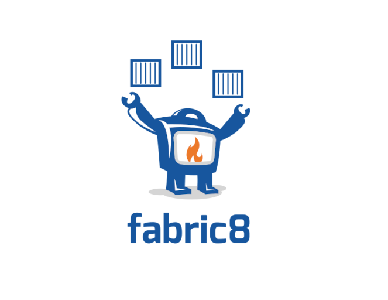
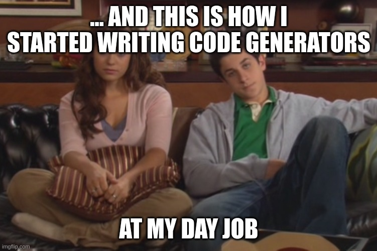
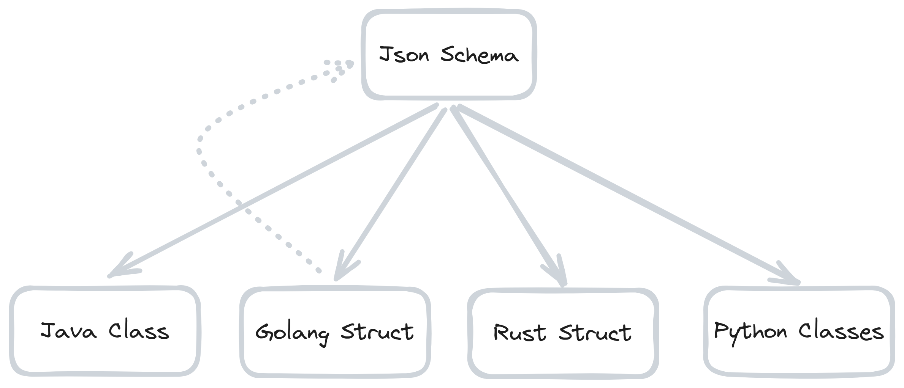
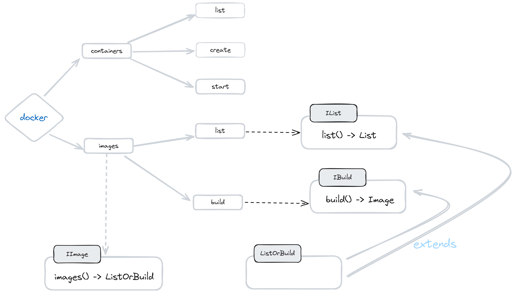
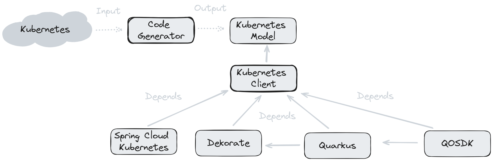
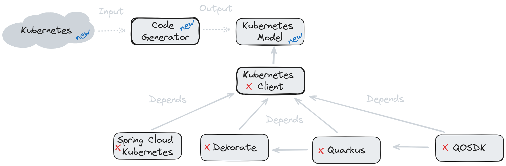
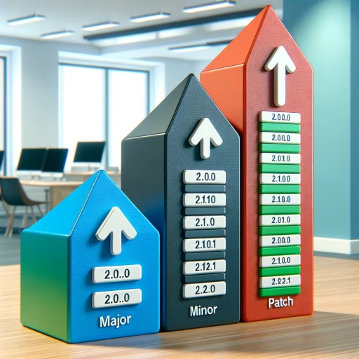

#### Things I learned
#### writing code generators for almost a decade

[Ioannis Canellos](https://iocanel.com)

Voxxed days Ioannina 2024
---
#### about me

---

#### great at writing bad code that generates cool stuff

---

#### why this talk ?

---

#### my usual talks ...

---

#### wider reach ...

---

#### a recent meeting

---

#### no such thing
- there are no **good** or **bad** practices
- there are decisions **well** or **poorly** thought
---

#### if there is one thing to takeaway ...

---

#### fashion driven industry

##### religiously following the big players ...
---

#### we often neglect to evaluate
- what fits our **project**
- what fits our **team**
---

### the talks: experiences

---

#### how did I get into code generators ?

##### lot of talent different styles

---
#### the builder pattern paradox


---
#### airport coding


---

#### why writting a code generator ?

##### Consistency
---

#### did it work ?

---

#### our focus shifted elsewhere ...

---

#### Kubernetes 

---

#### Kubernetes and Java

```java
ObjectMeta metadata = new ObjectMeta();
metadata.setName("nginx-deployment");

LabelSelector selector = new LabelSelector();
selector.setMatchLabels(Collections.singletonMap("app", "nginx"));
PodTemplateSpec podTemplate = new PodTemplateSpec();
podTemplate.setMetadata(new ObjectMeta());
podTemplate.getMetadata().setLabels(Collections.singletonMap("app", "nginx"));

PodSpec podSpec = new PodSpec();
Container container = new Container();
container.setName("nginx");
container.setImage("nginx:latest");
container.setPorts(Collections.singletonList(new ContainerPort(80)));
podSpec.setContainers(Collections.singletonList(container));
podTemplate.setSpec(podSpec);

Deployment deployment = new Deployment();
deployment.setMetadata(metadata);
deployment.setSpec(new DeploymentSpec());
deployment.getSpec().setReplicas(3);
deployment.getSpec().setSelector(selector);
deployment.getSpec().setTemplate(podTemplate);
```
---

#### Kubernetes and Java: Using a Builder  

```java
Deployment deployment = new DeploymentBuilder()
         .withNewMetadata()
             .withName("nginx-deployment")
         .endMetadata()
         .withNewSpec()
             .withReplicas(3)
             .withNewSelector()
                 .withMatchLabels("app", "nginx")
             .endSelector()
             .withNewTemplate()
                 .withNewMetadata()
                     .withLabels("app", "nginx")
                 .endMetadata()
                 .withNewSpec()
                     .addNewContainer()
                         .withName("nginx")
                         .withImage("nginx:latest")
                         .withNewContainerPort(80)
                     .endContainer()
                 .endSpec()
             .endTemplate()
         .endSpec()
     .build();
```
---


#### Kubernetes and Java: Builder Pros
- Readbility
- IDE assistance (code completion)
- Less imports to manage
- 1 - 1 match to model strcture
---

####

---

#### kubernetes domain is huge

---

#### needed a way to convert to java
- [OpenAPI](https://openapi-generator.tech/) / [Swagger](https://swagger.io/)
- [Protocol Buffers](https://developers.google.com/protocol-buffers/)
- [json schema](https://json-schema.org/)
---

#### json schema

---

#### once you get the model done
- easy to move to other languages
---

#### why writting a code generator ?

##### polyglotism
---
 
#### did it work ?

---

#### Some numbers
[Fabric8 Kubernetes Client](https://github.com/fabric8io/kubernetes-client)
- 308 Contributors
- 3.2K Stars on Github
- Used in more than 7K repositories on Github
---

#### other areas that could benefit from code generation ?

---

#### The Client Domain Specific Language

```java
client.deployments()
      .inNamespace("myproject")
      .withName("myapp")
      .get();
```

```java
client.services()
      .withLabel("app", "myapp")
      .list();
```


---

#### what is a DSL ?
- a specialized computer language
- focus on a specific domain
  - examples of domains
    - docker
    - kubernetes
    - integration
- often provided as a way 
  - chain functions / methods
  - to create natural language like expressions

```javascript
fetch('https://some.url').then(res => console.log(res));

```
---

#### next stop: DSL generator (again)

---

#### The challenges with DSL
- The larger the graph the harder to implement
- Hard to evolve
- Generics
---


#### DSL: High maintainance cost

---

#### why writting a code generator ?

##### maintainability / evolvability
---

#### did it work ?

---

#### kind of 
- Created [Fabric8 Docker Client](https://github.com/fabric8io/docker-client)
- Never managed to port DSL generator it to Kubernetes
- May or may not have been inspiration for some papers
---

#### why writting a code generator: recap
- consistency
- maintainability
- polyglotism
---

#### writing your own code generator ?
how ?
---

#### the most common approach to code generators

##### Templates
---

#### templates: a simple example
```java
package ${model.packageName};

import io.fabric8.kubernetes.api.model.DefaultKubernetesResourceList;

public class ${model.name}List extends DefaultKubernetesResourceList<${model.name}> {
}
```
[Quarkus Kubevirt Resource List Template](https://github.com/quarkiverse/quarkus-kubevirt/blob/main/templates/src/main/resources/resource-list.vm)
---

#### templates: the good
- simple
- easy to get started
- minimal learning curve
---

#### templates: a less simple example
```java
#set ($apiGroup = "")
#set ($apiVersion = "v1")
#set ($packageName  = "")
#foreach ($entry in ${model.entrySet()})
#set ($packageName  = $entry.getValue().getPackageName())
#foreach ($annotation in ${entry.getValue().getAnnotations()})
#if ($annotation.getClassRef().getFullyQualifiedName().equals("io.fabric8.kubernetes.model.annotation.Group"))
#set ($apiGroup = $annotation.getParameters().get("value").replace(".kubevirt.io","").replace("kubevirt.io", ""))
#end
#if ($annotation.getClassRef().getFullyQualifiedName().equals("io.fabric8.kubernetes.model.annotation.Version"))
#set ($apiVersion = $annotation.getParameters().get("value"))
#end
#end
#end
package $packageName;

#foreach ($entry in ${model.entrySet()})
import $entry.getKey();
import $entry.getKey()List;
#end

import io.fabric8.kubernetes.client.extension.ClientAdapter;
import io.fabric8.kubernetes.client.dsl.MixedOperation;
import io.fabric8.kubernetes.client.dsl.Resource;


#set ($apiVersion = $apiVersion.substring(0,1).toUpperCase()+$apiVersion.substring(1))
#set ($apiGroupLastDotIndex = $apiGroup.lastIndexOf(".") + 1)
#set ($className = $apiGroup.substring($apiGroupLastDotIndex)+$apiVersion+"DSL")
#set ($className = $className.substring(0,1).toUpperCase()+$className.substring(1))
#set ($dslName = "$className")
#set ($className = $className.replaceAll("DSL$", "Client"))
public class $className extends ClientAdapter implements $dslName {

  @Override
  public $className newInstance() {
    return new $className();
  }

#foreach ($entry in ${model.entrySet()})
#set ($plural = $entry.getValue().getName())
#foreach ($annotation in ${entry.getValue().getAnnotations()})
#if ($annotation.getClassRef().getFullyQualifiedName().equals("io.fabric8.kubernetes.model.annotation.Plural"))
#set ($plural = $annotation.getParameters().get("value"))
  @Override
  public MixedOperation<${entry.getValue().name}, ${entry.getValue().name}List, Resource<${entry.getValue().name}>> $plural() {
    return resources(${entry.getValue().name}.class, ${entry.getValue().name}List.class);
  }
#end
#end
#end
}
```
[Quarkus Kubevirt Client Adapter](https://github.com/quarkiverse/quarkus-kubevirt/blob/main/templates/src/main/resources/client.vm)
---


#### templates: the bad
- can't guarantee the rendered code correctness
- poor tooling (e.g. IDE support)
- they don't scale well
  - increased complexity
    - workarounds:
      - there are logicless template engines 
        - example: [{{ moustache }}](http://mustache.github.io)
---

#### template engine alternatives
- specialized generators 
  - Library
  - Create / Manipulate the AST
  - Render the code
---

 #### specialized generators: a golang example
```go
package main

import (
    "fmt"

    . "github.com/dave/jennifer/jen"
)

func main() {
	f := NewFile("main")
	f.Func().Id("main").Params().Block(
		Qual("fmt", "Println").Call(Lit("Hello, world")),
	)
	fmt.Printf("%#v", f)
}
```
[jennifer](https://github.com/dave/jennifer)
---

#### specialized generators: a java example

```java
 TypeDef greeter = new TypeDefBuilder()
                        .withKind(Kind.Inteface)
                        .withName("Greeter")
                        .addNewMethod()
                            .withName("helloWorld")
                        .endMethod()
                        .build();
                        
  System.out.println(greeter.render());
```
[sundrio](https://github.com/sundrio/sundrio)
---


 #### templates: when to use one ?
- use of specialized generator not possible
  - one is not available
  - mutliple languages or file formats
  - usually good for **project generators**
---

####  project generators: real world examples
[nunjucks](https://mozilla.github.io/nunjucks/)
- used in [backstage](https://backstage.io)
---


#### specialized generators: the good
- use the language strengths (flow control, lambdas, etc)
- organize code in multiple files
- composability
  - there are template engines that offer this
    - [apache velocity](https://velocity.apache.org/)
    - [handlebars](https://handlebarsjs.com/)
---

#### Specilized generators: the bad
- verbosity
- learning curve
---

#### Parsing and refactoring tools for code generation
- [Openrewrite](https://github.com/openrewrite/rewrite)
- [Treesitter](https://github.com/tree-sitter/tree-sitter)
---

#### What about AI & LLMs?

---

#### dealing with generated code
---

#### day to day
- Debuging generated code
- IDE support for generated code
- Editing generated code
- Incompatible code changes
---

##### incompatible changes

---

##### incompatible changes

---


##### semantic versioning

---

##### semver and codegen
- Hard to implement
  - unintended changes in public API
  - can often introduce unscheduled workload
---

##### check in generated code ?

##### controversial topic
---


##### check in generated code: the pros
- Tracking changes
- Enables [semantic versioning](https://semver.org/)
- Code is visible to code quality tools
- No issues with IDEs
- Easier to find and debug
- Environment friendly
  - Generate code only when model changes
    - Save time & CO2
---

##### check in generated code: the cons
- Developers can shoot their own foot
  - Manually adding changes on code that is often replaced
- Model and generated code can get out of sync
---


##### check in generated code: the workaround 
- CI tools
  - Github Actions ([example](https://raw.githubusercontent.com/quarkiverse/quarkus-authzed-client/main/.github/workflows/update-client.yml))
  - Gitlab Pipelines
---

##### check in generated code: typescript
- [TypeScript](https://www.typescriptlang.org/) code gets transpiled to JavaScript
- Even the slightest changes to typescript code affects generated code
- Re-generating is one way
- You may skip checking in the generated code
---


##### no one size fits all
No good or bad practices !
---

##### what to do with generated code: recap
- have a strategy for detecting changes
- if you can't prevent breakage communicate it
- only trigger generation when you have to
---

#### What about AI & LLMs?
- Do a great job to writting boilerplate code
- Excellent as editor assistants
  - [Github Copilot](https://github.com/copilot)
  - [Repl.it](https://repl.it)
  - [Codeium](https://codeium.com)
    - No training on non-permissively licensed code
---


#### LLMs as fully automated code generators
- Not accurate enough
- Not deterministic
---

#### LLMs as fully automated code generators: determinism
1st iteration
```python
def greet():
    print("Hello, world")
```

nth iteration
```python
def say_hello():
    print("Hello, world")
```
---

#### LLM generator: experiences

---

#### LLMs as fully automated code generators: Langchain
- [langchain](https://github.com/hwchase17/langchain) allows you to define tools that will be used by the LLM
  - possible applications
    - tools the enforce style or contract
    - tools the verify correctness
    - tools that align with existing code
---

#### Recap
- Code generation leads to efficiency
- Start with templates, move to specialized tools
- Only generate code when you need
- Have a strategy for tracking changes
- Cannot rely on AI just yet
---

#### Some links
- https://github.com/iocanel/presentations
- https://github.com/sundrio/sundrio
- https://github.com/fabric8io/kubernetes-client

#### 

----
